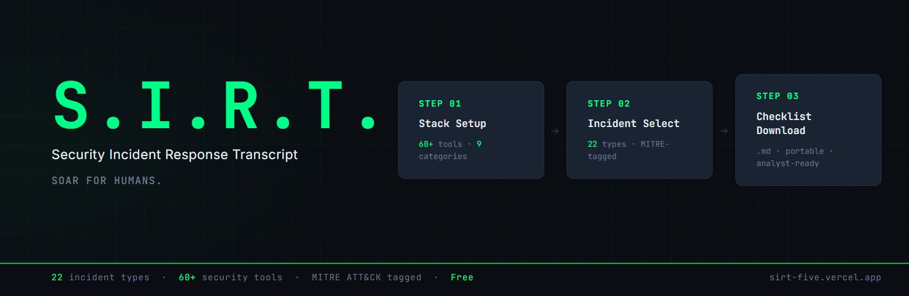

# S.I.R.T. - Security Incident Response Transcript

> SOAR for humans. Comprehensive IR checklists, tailored to your exact security stack.

> Current : v1.1

**Live:** [sirt-five.vercel.app](https://sirt-five.vercel.app/) | **Skill Bundle:** [Download v1.0](https://github.com/mello-io/SIRT/releases/tag/skill-v1.0)

---

## The Problem

Level 1 SOC analysts are the first line of defense against security incidents, yet they are often under-equipped for the speed and complexity that real-world triage demands. The gap between "alert fired" and "decision made" is where incidents are mishandled, escalated late, or closed incorrectly.

SOAR platforms solve this for well-resourced organisations through automated playbooks, but a large portion of security teams don't have SOAR. They rely on tribal knowledge, informal runbooks, and analyst intuition: none of which scale, and none of which are consistent.

**S.I.R.T. bridges that gap.** It produces highly specific, stack-aware, procedural incident response checklists tailored to an organisation's exact security toolset, so that analysts and their internal SOC AI can move faster, investigate more thoroughly, and reach defensible decision points with confidence.

S.I.R.T. does not ingest live data. It does not connect to production systems. It is a procedural intelligence layer; what SOAR does for machines, S.I.R.T. does for humans.

---

## How It Works

### Path A — API key (full web app)

```text
01  Set up your stack      →   Select your security tools from 60+ options across 9 categories.
                               Export a portable org-sec-stack.md profile.

02  Select incident type   →   Choose from 22 incident sub-types across 7 categories.
                               Select the affected asset type. Enter your LLM API key.

03  Download checklist     →   Get a phase-structured, MITRE-tagged, tool-specific IR checklist
                               as a portable .md file, ready for the analyst or their SOC AI.
```

### Path B — Claude Skill (no API key required)

```text
01  Download skill bundle  →   Download SIRT-skill-bundle-v1.0.zip from GitHub Releases.
                               Upload the 4 skill files to a Claude Pro/Team/Enterprise Project.

02  Generate config files  →   Use the web app to generate your org-sec-stack.md and
                               incident-type.md. No API key needed for this step.

03  Run in Claude          →   Upload both files to your Claude Project and type:
                               "Generate my IR checklist."
```

---

## Features

| Feature | Detail |
| --- | --- |
| **22 incident types** | 7 categories: Endpoint, Network, Identity, Data, App/Web, Cloud, Social Engineering |
| **60+ security tools** | 9 stack categories with mapped public documentation |
| **MITRE ATT&CK tagged** | Every checklist includes technique references linking to attack.mitre.org |
| **Multi-LLM** | Anthropic (Claude), OpenAI (GPT-4o), Google (Gemini), Mistral |
| **BYOK** | Bring your own API key, proxied through Vercel Functions, never stored |
| **Claude Skill** | No API key path - upload the skill bundle to a Claude Project and run locally |
| **Incident Type Generator** | Generate a portable `incident-type.md` session file in under 60 seconds |
| **Zero data retention** | Nothing persisted server-side. Org profile lives on your machine. Keys clear on tab close. |
| **6 IR phases** | Initial Verification → Scope Assessment → Containment → Eradication → Recovery → Reporting |
| **Decision points** | Minimum 3 explicit `⚠️ DECISION POINT` items per checklist |
| **Tool query blocks** | Real, tool-specific syntax (SPL, KQL, YARA, and more) for every tool in your stack |
| **Portable output** | Downloads as `SIRT-[incident]-[date].md`; readable offline, shareable, AI-ingestible |
| **Audit folder** | Public `/audit` directory with security hardening documentation |

---

## Incident Type Library

| Category | Sub-types |
| --- | --- |
| 🖥️ Endpoint / Host | Malware Execution, Ransomware, Suspicious Process / Code Injection |
| 🌐 Network | DDoS / Volumetric Attack, C2 / Beaconing, Recon / Network Scanning, Lateral Movement |
| 🔑 Identity & Access | Credential Brute Force, Privileged Account Abuse, MFA Bypass / Push Fatigue, Account Takeover |
| 📦 Data | Data Exfiltration, Insider Threat / Data Misuse, Unauthorized Data Access |
| 🌍 Application / Web | Phishing / Spear Phishing, Web Application Attack, Supply Chain Compromise |
| ☁️ Cloud & Infrastructure | Cloud Account Compromise, Misconfiguration / Public Exposure, Container / Kubernetes Threat |
| 🎭 Social Engineering | Business Email Compromise (BEC), Vishing / Smishing |

---

## Security Stack Categories

| Category | Example Tools |
| --- | --- |
| SIEM | Splunk, Microsoft Sentinel, IBM QRadar, Elastic, Google Chronicle |
| NGFW | Palo Alto PAN-OS, Fortinet FortiGate, Cisco Firepower, Check Point |
| EDR / MDR | CrowdStrike Falcon, Microsoft Defender for Endpoint, SentinelOne, Cortex XDR |
| IAM / PAM | Entra ID, Okta, CyberArk, BeyondTrust, HashiCorp Vault |
| Vulnerability Management | Tenable, Qualys, Rapid7 InsightVM, Wiz, Orca |
| NDR / Traffic Analysis | Darktrace, Vectra AI, Zeek, Suricata, Corelight |
| Threat Intelligence | MISP, Recorded Future, OpenCTI, VirusTotal |
| Email Security | Proofpoint, Mimecast, Defender for Office 365, Abnormal Security |
| Cloud Security | AWS Security Hub + GuardDuty, Defender for Cloud, Prisma Cloud |

78 tools across 9 categories. Custom tools can be added at setup.

---

## Output Format

Every generated checklist (`SIRT-[incident-type]-[date].md`) contains:

1. **Header block** - org name, incident type, asset type, severity, detection time, timestamp, prompt version
2. **Incident overview** - what this incident type means in context of the affected asset
3. **MITRE ATT&CK reference block** - relevant techniques with direct links
4. **Procedural checklist** - 6 phases, tool-specific steps with query blocks
5. **Decision points** - `⚠️ DECISION POINT` callouts at genuine investigation forks
6. **Escalation criteria** - explicit conditions for L2/L3 escalation

---

## Contributing

See [CONTRIBUTING.md](./CONTRIBUTING.md).

---

## License

AGPL-3.0 © 2026 [mello-io](https://github.com/mello-io)

S.I.R.T. is free software licensed under the GNU Affero General Public License v3.0. Any modified version deployed as a network service must make its source code publicly available. See [LICENSE](./LICENSE) for full terms.

---

*MITRE ATT&CK® is a registered trademark of The MITRE Corporation.*
